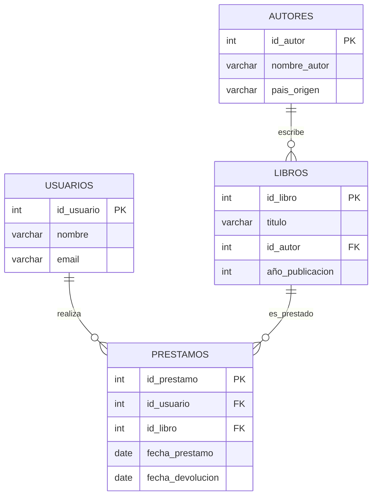

# 🏛️ Taller Práctico de SQL - Sistema de Biblioteca

<div align="center">


**Presentación interactiva para aprender SQL de forma práctica**

*🚀 ¡Una aventura SQL increíble te espera! 🚀*

</div>

---

## ✨ **Descripción**

<div align="center">

### 🎓 **Taller educativo diseñado para consolidar conocimientos fundamentales de SQL**

Una presentación web interactiva que guía paso a paso la creación y manejo de una base de datos de biblioteca simple, perfecta para aprender las operaciones CRUD y relaciones entre tablas.

</div>

---

## 🎯 **Objetivos del Taller**

<table>
<tr>
<td width="50%">

### 📚 **Conocimientos a Consolidar**
- **Sentencias fundamentales**: CREATE, INSERT, SELECT, UPDATE, DELETE
- **Relaciones** entre tablas/entidades  
- **Operaciones intermedias**: JOIN, GROUP BY, WHERE
- **Claves primarias y foráneas** (FK/PK)

</td>
<td width="50%">

### 🛠️ **Herramientas de Trabajo**
- **SQL Online**: [sqliteonline.com](https://sqliteonline.com/)
- **Opción recomendada**: "Learn and Share SQL"
- **Sin instalación**: Funciona directo en el navegador
- **Presentación interactiva**: Navegación con teclado y botones

</td>
</tr>
</table>

---

## 🏗️ **Modelo de Datos - 4 Entidades Relacionadas**

<div align="center">



</div>

### 📦 **Entidades del Sistema**

<table>
<tr>
<td width="25%">

### 👥 **USUARIOS**
<div align="center">


</div>

- ID Usuario (PK)
- Nombre  
- Email

</td>
<td width="25%">

### ✍️ **AUTORES** 
<div align="center">


</div>

- ID Autor (PK)
- Nombre Autor
- País Origen

</td>
<td width="25%">

### 📚 **LIBROS**
<div align="center">


</div>

- ID Libro (PK)
- Título
- ID Autor (FK)
- Año Publicación

</td>
<td width="25%">

### 📋 **PRÉSTAMOS**
<div align="center">


</div>

- ID Préstamo (PK)
- ID Usuario (FK) 
- ID Libro (FK)
- Fecha Préstamo
- Fecha Devolución

</td>
</tr>
</table>

---

## 🚀 **Cómo Usar la Presentación**

### 📥 **Instalación**
```bash
# Clonar el repositorio
git clone https://github.com/tu-usuario/taller-sql-biblioteca.git
cd taller-sql-biblioteca

# Abrir la presentación
# Simplemente abre index.html en tu navegador
```

---

## 📋 **Contenido del Taller**

### 🎭 **Estructura de la Presentación**

<table>
<tr>
<td width="33%">

### 🌟 **Introducción**
- Slide 1: Bienvenida 
- Slide 2: Objetivos
- Slide 3: Modelo de datos

</td>
<td width="33%">

### 🏗️ **Construcción**
- Slides 4-5: CREATE TABLE
- Slides 6-8: INSERT datos
- Slides 9-10: SELECT básicos

</td>
<td width="33%">

### 🔍 **Consultas Avanzadas**
- Slides 11-14: JOINs y GROUP BY
- Slide 15: Práctica libre
- Slide 16: Cierre

</td>
</tr>
</table>

### 💻 **Ejemplos de Código SQL Incluidos**

#### 📝 **Creación de Tablas**
```sql
-- Diferentes formas de definir FK
CREATE TABLE libros (
    id_libro INT PRIMARY KEY,
    titulo VARCHAR(100),
    id_autor INT REFERENCES autores(id_autor),
    año_publicacion INT
);
```

#### 🔍 **Consultas con JOIN**
```sql
-- Libros con sus autores
SELECT libros.titulo, autores.nombre_autor 
FROM libros 
JOIN autores ON libros.id_autor = autores.id_autor;
```
---

## 📈 **Progresión de Aprendizaje**

<div align="center">

```
🎯 Nivel Principiante → 🚀 Nivel Intermedio

CREATE TABLE → INSERT → SELECT → JOIN → GROUP BY
     ↓              ↓        ↓       ↓         ↓
  Estructura    Datos    Consulta  Relaciones  Agregación
```

</div>

---

<div align="center">

### 🎓 **¡Prepárate para una aventura SQL increíble!** 

### 👨‍💻 **Instructores: [@maxioru](https://github.com/MaxiOru/MaxiOru) & Keila** 👩‍💻


**📚 ¡Es hora de dominar SQL con estilo! 📚**

</div>
